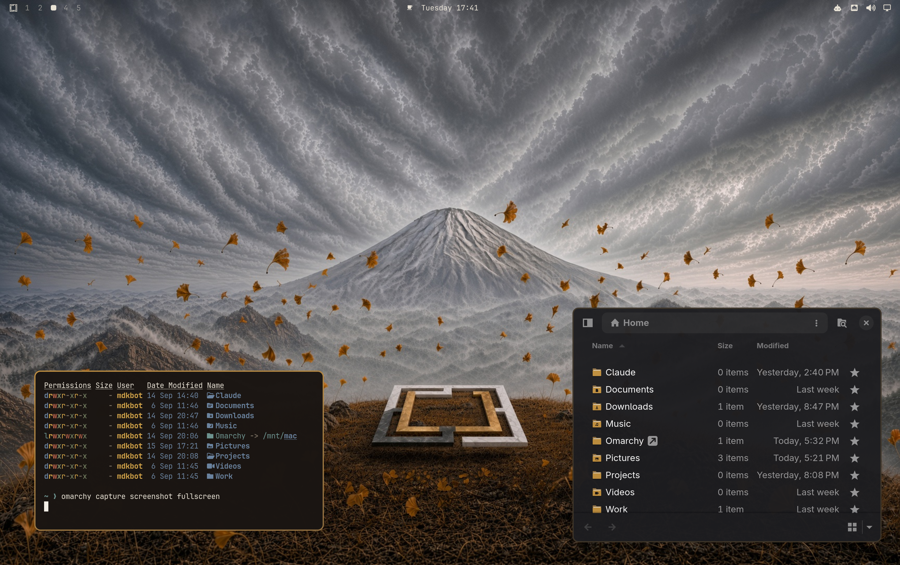
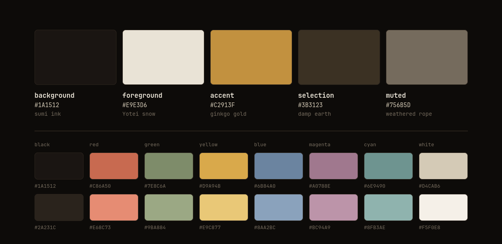
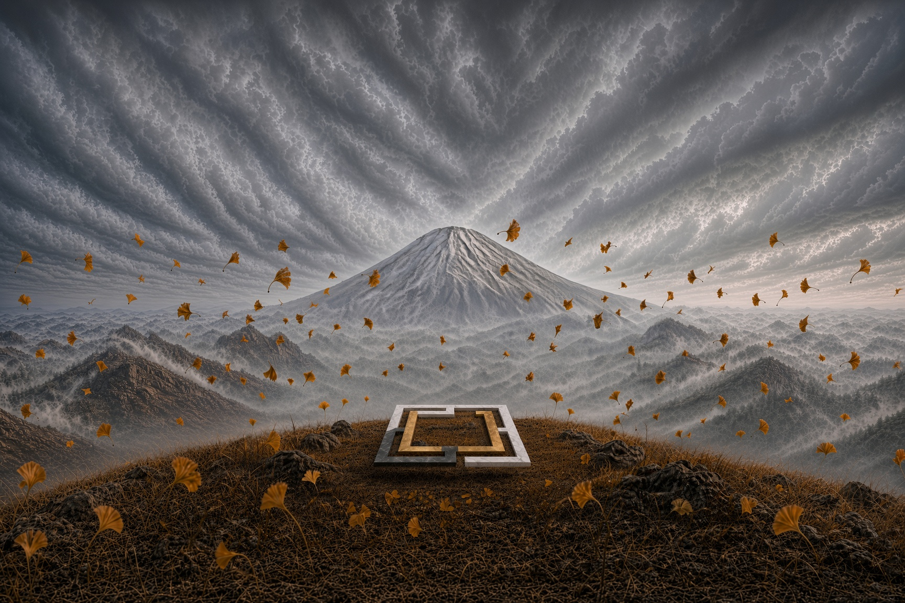
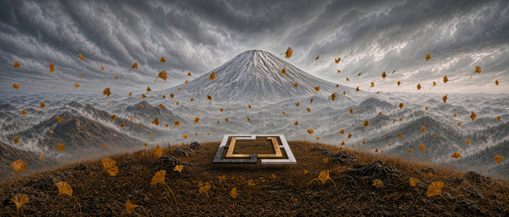
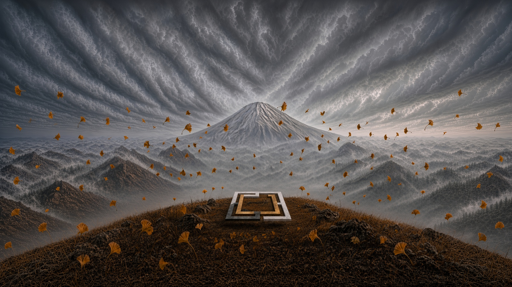

<div align="center">

# Ghost Of Omarchy

**An [Omarchy](https://omarchy.org/) theme in sumi ink, Yōtei snow and ginkgo gold.**

A palette sampled from the *Ghost of Yōtei* cover art — pulled off the pixels,
not eyeballed — and carried through every config Omarchy generates: terminals,
editors, the bar, the lock screen, window borders, even the folder icons.



</div>

## The inspiration

The *Ghost of Yōtei* cover is three colours doing all the work, and it is worth
being precise about which three.

**Sumi ink, not black.** The cover's darks are brown-cast — `#221C17` where you
expect `#000000`. Warmth that low in the value range is the whole reason the art
feels like ink on paper instead of a screen turned off. The theme's background
is `#1A1512`, and every darker step (`#13100D`, `#0D0B09`) keeps the same brown
cast rather than sliding toward neutral.

**Yōtei snow.** Mount Yōtei's snowfield is the brightest large area in the
frame, and it is not white — it's washi, `#E9E3D6`, paper that has been in a
room for a while. Used as the foreground it reads as legible without the glare
of `#FFFFFF` on a dark terminal.

**Ginkgo gold.** One loud colour, `#C2913F`, and the art spends it on falling
leaves. The theme spends it the same way: window borders, the selected row in
every menu, the lock icon, the keyboard backlight. Everything else stays quiet
so the gold keeps meaning *this one, here*.

The supporting colours come from the same frame rather than from a generic ANSI
ramp — lacquered vermillion `#C86A50`, susuki grass `#7E8C6A`, Hokkaido winter
water `#6E9490`, mountain haze `#6B84A0`, ume plum at dusk `#A0788E`.

## Install

```bash
omarchy theme install https://github.com/jamesbrock/Ghost-of-Omarchy.git
```

That clones into `~/.config/omarchy/themes/ghost-of-omarchy` and applies
immediately. Omarchy takes the theme's name from the repo name — lowercased,
with a leading `omarchy-` and trailing `-theme` stripped if present — and the
theme picker title-cases it back, so to return to it later:

```bash
omarchy theme set "Ghost Of Omarchy"
```

Optional, and worth it — the matching folder icons (see [Icons](#icons)):

```bash
omarchy pkg add papirus-icon-theme
~/.config/omarchy/themes/ghost-of-omarchy/scripts/install-icons.sh
```

## Palette



| Role | Hex | Taken from |
|---|---|---|
| `background` | `#1A1512` | sumi ink — warm, brown-cast |
| `foreground` | `#E9E3D6` | Yōtei snow / washi paper |
| `accent` | `#C2913F` | ginkgo gold — window borders are this |
| `selection` | `#3B3123` | damp earth |
| `muted` | `#756B5D` | weathered rope |

The sheet above is rendered from `colors.toml` by
[`scripts/render-palette.sh`](scripts/render-palette.sh), so it cannot drift
from the values it documents. Re-run it after changing a colour.

## Wallpapers

Three cuts of the same scene — Yōtei under a raked sky, ginkgo leaves coming
down over the Omarchy mark — one per display shape. They ship in
`backgrounds/` and cycle with `omarchy theme bg next`.

### 1 · Laptop — 1728×1152, 3:2



The default, and the tallest framing of the three: the full cloud ceiling
above the peak and the full ginkgo-strewn foreground below it. Sized for 3:2
panels (MacBook, Surface, Framework), and the safest pick on anything taller
than 16:9.

### 2 · Ultrawide — 2128×912, 21:9



The same frame cropped to a letterbox for 3440×1440 and friends. The mountain
sits lower and the surrounding ridgelines carry the extra width, so the centre
of the image stays uncluttered where floating windows tend to land.

### 3 · Widescreen — 1792×1008, 16:9



The 16:9 middle ground for 1080p, 1440p and 4K panels, and for a VM window at
the usual desktop aspect. More sky than the ultrawide cut, less than the laptop
one.

Three things to know before adding your own:

- Omarchy's background layer is hardcoded to `PreserveAspectCrop`, with no
  config knob. A wallpaper wider than the screen is centre-cropped and
  magnified, never letterboxed — so cut one per display shape rather than
  hoping one file covers everything. That is why these three are named by
  target aspect rather than by version.
- Backgrounds are cycled in filename order, which is what the number prefixes
  are for; `backgrounds[0]` is what a fresh `omarchy theme set` picks. Drop new
  images into `backgrounds/` and re-apply the theme. Wallpapers you would
  rather not commit go in `~/.config/omarchy/backgrounds/ghost-of-omarchy/`
  instead — Omarchy reads both.
- `omarchy theme set <the-current-theme>` advances to the *next* background. To
  pin one, use `omarchy theme bg set <path>`.

## What's in here

```
colors.toml          the palette, and the only file you normally edit
backgrounds/         wallpapers, cycled with `omarchy theme bg next`
  1-ghost-of-omarchy-laptop.jpg      1728x1152, 3:2
  2-ghost-of-omarchy-ultrawide.jpg   2128x912,  21:9
  3-ghost-of-omarchy-widescreen.jpg  1792x1008, 16:9
preview.png          2940x1848, shown in the theme switcher
preview_ultrawide.png
                     3440x1440, the same desktop on a 21:9 panel
unlock.png           Plymouth boot logo, the wordmark in ginkgo gold
preview-unlock.png   1920x1080 preview of that boot screen
icons.theme          GTK icon theme name
keyboard.rgb         keyboard backlight colour
shell.lock.toml      lock screen password card
docs/palette.png     the swatch sheet above, generated from colors.toml
scripts/             one-time icon build, and the palette renderer
```

Everything else Omarchy needs is **generated**. `omarchy theme set` runs
`colors.toml` through the templates in `$OMARCHY_PATH/default/themed/*.tpl` and
writes ~17 config files — alacritty, ghostty, kitty, foot, btop, helix, neovim,
hyprland, hyprlock, chromium, obsidian, vscode, the shell and bar — into
`~/.local/state/omarchy/current/theme/`.

Those generated files are rebuilt from scratch on every theme switch, so
editing them is wasted work. Change `colors.toml` and re-apply:

```bash
omarchy theme set "Ghost Of Omarchy"
```

## Details worth knowing

### Window borders

```toml
hyprland_active_border   = "accent brown 45deg"
hyprland_inactive_border = "selection"
```

A gradient spec is theme colour names plus an optional angle, so the focused
window gets a 45° ginkgo-gold-to-umber edge. Most themes leave the second key
out; left unset, Omarchy falls back to a hardcoded `rgba(595959aa)` — a neutral
grey that appears nowhere else in this palette.

### Lock screen

`shell.lock.toml` patches the `[lock]` section of the generated `shell.toml`.
The override **replaces the section wholesale**, so every key the template sets
is repeated in it; only `background` differs from what would be generated, one
step darker than the bar so the password card reads as inset over the wallpaper.
Delete the file to fall back to the generated section.

### Icons

`icons.theme` names `GhostOfOmarchy` — Papirus-Dark with only the folder family
recoloured:

| Papirus | here | what it is |
|---|---|---|
| `#5294e2` | `#C2913F` | folder front face |
| `#4877b1` | `#937140` | folder back tab |
| `#1d344f` | `#1A1512` | the emblem glyph on the face |
| `#e4e4e4` | `#E9E3D6` | the paper sheet |

**Omarchy never installs an icon theme, so this one has to be built once per
machine:**

```bash
omarchy pkg add papirus-icon-theme
./scripts/install-icons.sh
```

That writes ~1400 recoloured SVGs to `~/.local/share/icons/GhostOfOmarchy` and
leaves everything else falling through to Papirus-Dark. Application icons that
happen to use Papirus blue are deliberately left alone, and the 16x16 set is
symbolic — it follows the text colour already, so it isn't touched. Re-run it
after a Papirus update to pick up new icons.

Until you run it, `icons.theme` names a theme that isn't on disk and GTK falls
back to its default. If you'd rather the theme be self-sufficient, set
`icons.theme` to `Papirus-Dark` and drop the script — you lose the exact colour
match and get Papirus's blue folders back.

> Stock Omarchy themes name a `Yaru-*` variant here and the base package list
> installs `yaru-icon-theme`, but that package is absent from the aarch64
> repos — on ARM the default leaves GTK pointing at an icon theme that was
> never installed.

### Keyboard

`keyboard.rgb` is a single hash-less hex value applied to the keyboard
backlight. Inert without RGB hardware.

## Credit

Palette derived from the cover art of *Ghost of Yōtei* (Sucker Punch
Productions / Sony Interactive Entertainment), which is theirs, not mine. The
colour values in `colors.toml` are original work. The images in `backgrounds/`
are shipped as a starting point under no claim of ownership — swap in your own.

`unlock.png` and `preview-unlock.png` are Omarchy's own wordmark recoloured to
this palette, the same thing every stock theme ships.

Released under the [MIT License](LICENSE).
